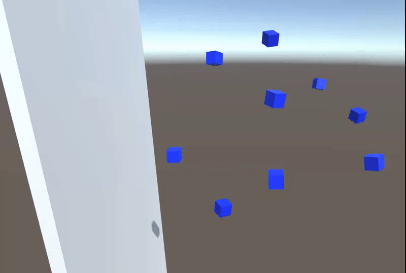
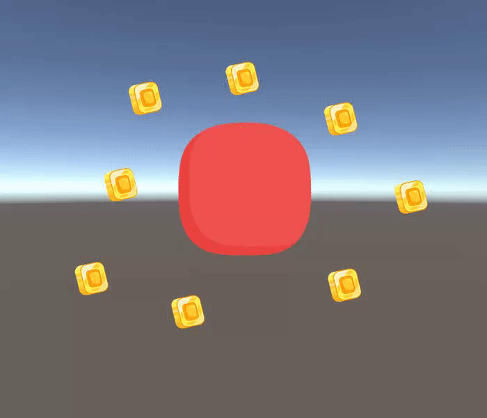

# Unity Gravity System

**Authors:** [DoctorWolfy121](https://github.com/DoctorWolfy121)

## Introduction

Unity Gravity System is an out of the box simple solution for customizable gravity in unity. Multiple types of gravity sources, such as directional gravity, that allow gravity to go any direction. Planet gravity, which allows for spherical planet-like gravity. little to no code is required to set up gravity sources and items.

These documents will include detailed install and getting started instructions. As well as details of every class, interface and script that is included in the asset, this will allow anyone to easily expand on the gravity system and make more creative gravity sources.

Here are some simple examples of what is possible with the gravity system:

